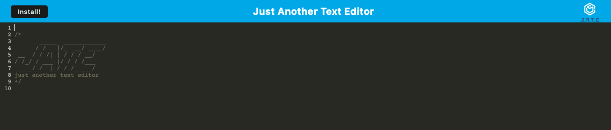

# JATE - Just Another Text Editor
Progressive Web Applications (PWA) Challenge: Text Editor

Welcome to the PWA Text Editor Application! This project showcases a powerful text editor that operates directly in your web browser. It meets the criteria for a Progressive Web Application (PWA), incorporating data persistence techniques, offline functionality, and efficient deployment. This README will guide you through the application's features, installation, usage, and deployment process.

## Table of Contents

- [Features](#features)
- [Installation](#installation)
- [Usage](#usage)
- [Credits](#credits)
- [License](#license)

## Features

- Create and edit notes or code snippets seamlessly within your web browser.
- Enjoy a responsive and user-friendly interface designed for an optimal editing experience.
- Leverage the power of a Progressive Web Application, enabling offline access and smooth interactions.
- Ensure your data is stored securely using IndexedDB, offering redundancy in case of unsupported storage options.
- Easily install the application as a desktop icon for quick access.
- Benefit from automatic service worker registration and caching of static assets for improved performance.

## Installation

This text editor can be downloaded for offline use by clicking the "Install!" button shown in the following images: 
,
,
,

## Usage 

Upon launching the application, a welcoming user interface awaits you. Here, you can seamlessly initiate the creation and modification of your textual notes or code snippets.

Fear not about losing your progress, as your changes are automatically stored in IndexedDB. This resilient mechanism guarantees the security of your data, even in scenarios where the application is inadvertently closed or internet connectivity is lost.

Rest assured, the application embraces next-gen JavaScript practices, upholding its seamless functionality while remaining free of errors.

To enhance accessibility, a convenient "Install" button empowers you to add the PWA to your device. Once installed, you can effortlessly access the application from your home screen.

Behind the scenes, a service worker, powered by workbox, diligently pre-caches static assets. This behind-the-scenes effort culminates in a seamless experience, extending its reach to offline mode as well.

## Credits

The starter code for this application can be found by going to the following GitHub [repository](https://github.com/coding-boot-camp/cautious-meme)

## License

Please refer to the license in the repo